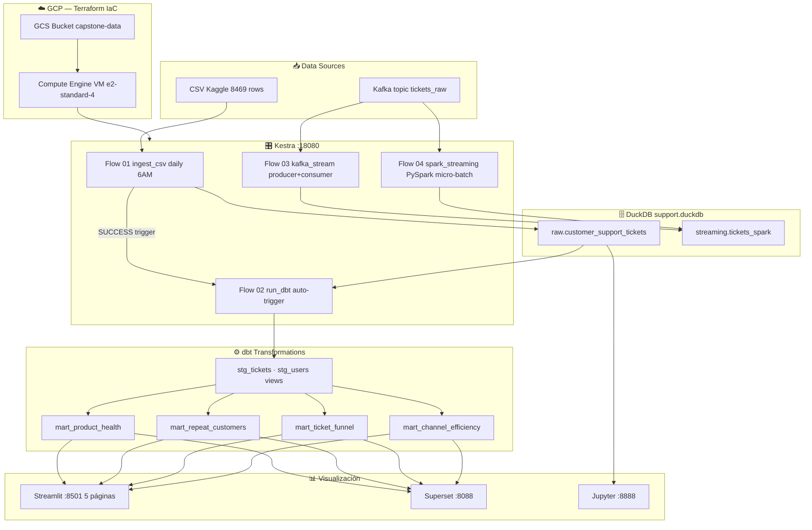

# Capstone: Customer Support Ticket Analytics
**Data Engineering Zoomcamp — Proyecto Final**

---

## Stack tecnológico

| Capa | Herramienta | Por qué |
|------|-------------|---------|
| Orquestación | Kestra | Flows YAML, UI web, sin código extra |
| Storage | DuckDB | OLAP embebido, perfecto para <5M filas |
| Transform | dbt-duckdb | Modelos ya hechos, lineage, tests |
| Visualización | Streamlit o Apache Superset | Conecta a DuckDB directo |
| Streaming (opcional) | Kafka nativo (bitnami) | ~300MB vs ~600MB de Redpanda |
| Exploración | Jupyter | Notebooks de análisis |

**¿Por qué NO Redpanda?**
Redpanda pesa ~600MB de imagen y corre un proceso pesado. `bitnami/kafka:3.7` hace exactamente lo mismo para este proyecto usando ~300MB. Si no necesitás streaming en producción, dejalo comentado en el docker-compose.

**¿Por qué NO Spark ni Postgres?**
El dataset tiene entre 8K y 200K filas. DuckDB corre queries analíticas a esa escala en milisegundos. Spark sería over-engineering y Postgres es OLTP, no OLAP.

---

## Dataset

**Primary:** [Customer Support Ticket Dataset](https://www.kaggle.com/datasets/suraj520/customer-support-ticket-dataset) — CSV, ~8,469 filas

**Columnas clave:**
- `Ticket ID`, `Customer Name`, `Customer Email`, `Customer Age`
- `Customer Gender`, `Product Purchased`, `Date of Purchase`
- `Ticket Type`, `Ticket Subject`, `Ticket Description`
- `Ticket Status` (Open / Closed / Pending Customer Response)
- `Resolution`, `Ticket Priority` (Critical / High / Medium / Low)
- `Ticket Channel` (Email / Chat / Phone / Social media)
- `First Response Time`, `Time to Resolution`
- `Customer Satisfaction Rating` (1-5)

**Alternativa batch mayor:**
[200K Records Version](https://www.kaggle.com/datasets/mirzayasirabdullah07/customer-support-tickets-dataset-200k-records)

---

## Preguntas analíticas que podés responder

### 🏥 Product Health
| Pregunta | Página |
|----------|--------|
| ¿Qué productos tienen peor tasa de resolución? | Product Health |
| ¿Cuál es el health score de cada producto (0-100)? | Product Health |
| ¿Qué combinación Producto × Subject acumula más críticos sin resolver? | Product Health |
| ¿Hay productos donde los tickets nunca se cierran? | Product Health |
| ¿Qué productos tienen baja satisfacción Y alta tasa de escalamiento? | Product Health |
 
### 🚨 Churn Risk
| Pregunta | Página |
|----------|--------|
| ¿Qué clientes abrieron más de 1 ticket? | Churn Risk |
| ¿Los clientes recurrentes tienen peor satisfacción que los de primera vez? | Churn Risk |
| ¿Qué productos generan más clientes recurrentes? | Churn Risk |
| ¿Cuáles son los clientes con mayor riesgo de abandono? | Churn Risk |
| ¿Qué canal prefieren los clientes en riesgo de churn? | Churn Risk |
 
### 🔽 Ticket Funnel
| Pregunta | Página |
|----------|--------|
| ¿Dónde se atascan más los tickets en el pipeline? | Ticket Funnel |
| ¿Hay subjects con 0% de cierre (dead-ends)? | Ticket Funnel |
| ¿Qué % de tickets críticos siguen sin primera respuesta? | Ticket Funnel |
| ¿Qué canal tiene mayor proporción de tickets Open? | Ticket Funnel |
| ¿Qué tipo de ticket tiene peor conversión a Closed? | Ticket Funnel |
 
### 📡 Channel Efficiency
| Pregunta | Página |
|----------|--------|
| ¿Qué canal resuelve por encima del promedio global? | Channel Efficiency |
| ¿Cuál es el cuello de botella: alto volumen + baja resolución? | Channel Efficiency |
| ¿Hay canales donde los tickets críticos se acumulan más? | Channel Efficiency |
| ¿El canal con más satisfacción también tiene más resolución? | Channel Efficiency |
| ¿Cuál es el desvío de satisfacción de cada canal vs el global? | Channel Efficiency |

---

---



Archivo: [`architecture.mmd`](./architecture.mmd) — renderizable en [mermaid.live](https://mermaid.live) o con `mmdc`.
 
---

## Estructura del proyecto

```
capstone_support/
├── Makefile                    ← All
├── docker-compose.yml          ← Stack completo
├── .env                        ← Credenciales (no commitear)
├── README.md
├── flows/                             # Kestra flows
│   ├── 01_ingest_csv.yml              # Descarga + ingesta + quality check
│   ├── 02_run_dbt.yml                 # dbt run + test (auto-trigger)
│   ├── 03_kafka_stream.yml            # Producer + consumer Kafka
│   └── 04_spark_streaming.yml        # PySpark Structured Streaming
├── dbt/capstone_support/
│   └── models/
│         ├── staging/
|           └── schema.yml
|           └── sources.yml
│           └── stg_tickets.sql        # Limpieza, tipos, flags, surrogate key
│           └── stg_users.sql          # Dedup de clientes
│         ├── marts/
│           └── mart_product_health.sql
│           └── mart_repeat_customers.sql
│           └── mart_ticket_funnel.sql
│           └── mart_channel_efficiency.sql
|         ├─ seeds
                └──customer_support_tickets.csv
|         ├─ target
|         ├─ tests
|         ├─ dbt_project.yml
|         ├─ packages.yml
|         ├─ packages-lock.yml
|         ├─ Dockerfile.dbt
|         ├─ dockerfile
|         ├─ package-lock.yml
|         ├─ profiles.yml
├── terraform/
│   ├── main.tf                        # VM + GCS + Firewall + SA
│   ├── variables.tf
│   └── outputs.tf                     # IPs y URLs del stack
├── scripts/
│   └── download_dataset.py            # Descarga automática desde Kaggle
|   └── init_duckdb.py                  ← Setup inicial de schemas
├── streamlit/
│   ├── app.py                         # Home con links a las 5 páginas
│   ├── requirements.txt
│   ├── .streamlit/config.toml         # Tema oscuro + puerto 8501
│   ├── utils/
│   │   ├── __init__.py
│   │   ├── db.py                      # Conexión DuckDB auto-detect
│   │   └── sidebar.py                 # Sidebar compartido
│   └── pages/
│       ├── 1_Product_Health.py
│       ├── 2_Churn_Risk.py
│       ├── 3_Explorer.py
│       ├── 4_Channel_Efficiency.py
│       └── 5_Ticket_Funnel.py
├── notebooks/
│   ├── 1_ingestion.ipynb 
│   ├── 2_batch_processing_tickets.ipynb
│   ├── 2_transformation.ipynb
│   ├── 3_analytics_and_output.ipynb
│   └── customer_service1.ipynb
├── duckdb/
│   └── support.duckdb          ← Generado automáticamente
└── data/
    └── customer_support_tickets.csv
```

---

## Capas de DuckDB

```
raw.*          ← Datos tal cual vienen del CSV (sin transformar)
staging.*      ← Limpieza, tipos, renombrado (dbt)
marts.*        ← Tablas agregadas para dashboards (dbt)
streaming.*    ← Datos que llegan por Kafka (opcional)
```

---

## Dashboards sugeridos en Streamlit.
         

---
---

## Setup rápido

```bash
# 1. Git clone repo or open codespace

# 2. Levantar el stack 
Make up

# 3. kestra + dbt + streamlit
Make pipeline 

```

---

**Recomendaciones:**
- Kafka queda comentado — activalo solo para el módulo de streaming
